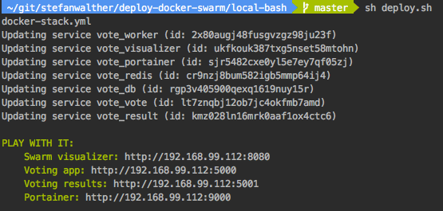
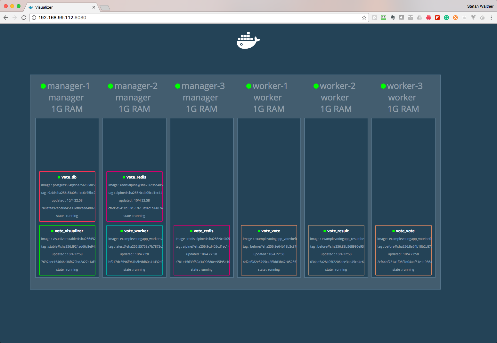

# Deploy a swarm cluster on your local machine

## Summary

- Create a few machines in VirtualBox
- Init a swarm (manager + worker nodes)
- Deploys a docker-compose (v3) file

## Prerequisites

- [VirtualBox](https://www.virtualbox.org/)
- [Docker for Mac](https://docs.docker.com/docker-for-mac/) / [Docker for Windows](https://docs.docker.com/docker-for-windows/)

_Note:_ The scripts are only tested on OSX, testing on Windows needs to be done.

## Run

### Provision the environment

```sh
$ sh provision.sh
```

Result:  

- You have now several machines in your VirtualBox (as defined in `config.sh`).
- Have a look into VirtualBox to double-check if the newly created machines are there.

Caveats:  

- If a machine already exists with the same name (e.g. `manager-1`), then the setup-script will delete the existing one and create a new one.

### Create the Docker Swarm

Based on the previously created machines, now let's create a Docker swarm:

```sh
$ sh swarm-init.sh
```


### Deploy a compose file

Deploy the swarm as defined in `./../lib/docker-stack.yml`

```sh
$ sh deploy.sh
```

Point to another swarm file:

```
$ sh deploy.sh -f ./docker-stack.modified.yml
```

_Note: _docker-stack.modified.yml is not part of this project, just create it yourself ;-)_

### Destroy the environment

To destroy the entire - previously created - environment, run

```sh
$ sh destroy.sh
```

This destroys all machines on VirtualBox, all managers and all workers.

### All Together

Do run the following above described tasks

```sh
$ sh all.sh
```

This will:

- Provision the environment
- Create the Docker swarm
- Deploy the Docker stack

## Configuration

All possible configurations are stored in `config.sh`:

- `NUM_MANAGERS` - Amount of managers to provision (defaults to `3`).
- `NUM_WORKERS` - Amount of workers to provision (default to `3`).
- `MACHINE_NAME_MANAGER_PREFIX` - Prefix for managers (defaults to `manager-`).
- `MACHINE_NAME_WORKER_PREFIX` - Prefix for managers (defaults to `worker-`).


## Play with it

Get the ip-address of the primary manager:
```sh
$ docker-machine ip manager-1
```

**Open the UIs:**
[Swarm visualizer](https://hub.docker.com/r/dockersamples/visualizer/): http://<manager-ip>:8080  
Voting app: http://<manager-ip>:5000  
Voting results: http://<manager-ip>:5001  
[Portainer](http://portainer.io/): http://<manager-ip>:9000    

## Some screenshots

### Deploy/Update the Stack



### Visualizer



## Tested on

- macOS Sierra, v10.12.14
- Windows 10

## Known limitations

- Color coding in Windows' git bash does not work

## Todos

- [ ] Security setup, TSL
- [ ] Expose configuration to be arguments (or not?!)
- [ ] If there is not default docker-machine, then we run into troubles.
- [ ] Test on Windows
- [ ] Use labels to get the UI-address of each service (nice to have, just an idea)
- [ ] Use newer version of swarm-visualizer
- [ ] Output formatting on windows doesn't work

## Reference links

Some articles which inspired this work.

- [Create a swarm cluster with Docker 1.12 swarm mode](http://lucjuggery.com/blog/?p=566) - Great article, thx a lot.
- https://medium.com/towards-data-science/deploy-a-nodejs-microservices-to-a-docker-swarm-cluster-docker-from-zero-to-hero-464fa1369ea0#.wv1hrp285
- https://github.com/aelsabbahy/miniswarm
- https://github.com/microservices-demo/microservices-demo
- https://gist.github.com/ekristen/11254304