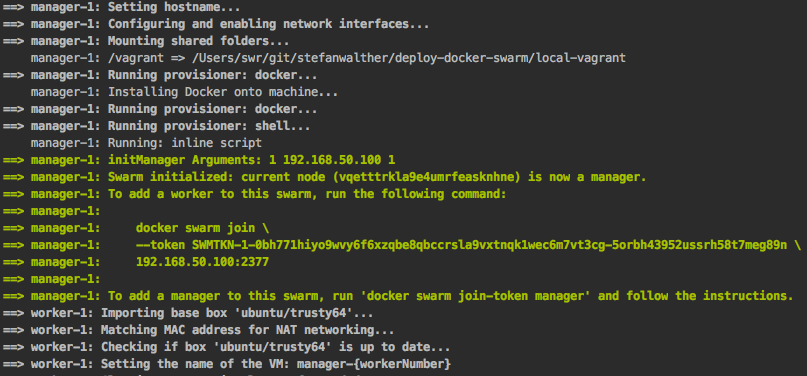

# Deploy a swarm cluster on your local machine (using Vagrant)

## Summary

The following tasks will be performed in this solution:

- Create a configurable number of machines (managers & workers) on your local VirtualBox
- Init a Docker swarm (manager + worker nodes)
- Deploy a Docker stack (Docker compose v3; swarm mode)


## Prerequisites

- [VirtualBox](https://www.virtualbox.org/)
- [Docker for Mac](https://docs.docker.com/docker-for-mac/) / [Docker for Windows](https://docs.docker.com/docker-for-windows/)
- [Vagrant](https://www.vagrantup.com/)

## Run

If you have already installed all of the pre-requisites, then you are ready to go!

Run with default options (as defined in `./configs/config.yml`).

```sh
$ vagrant up
```

This will 

- Provision 3 managers, 
- 2 workers and 
- Deploy, initialize a docker swarm and 
- Deploy the services as defined in `./../lib/docker-stack.yml`.

## Configuration

All configuration is driven through configuration files.
In the basic example above the default configuration file `./configs/config.yml` was used.

You can either

- change the default config file
- or pass another one to the Vagrantfile

### Changing the default configuration file

Open the `config.yml` file to change the configuration options:

- `NUM_OF_MANAGERS` - Number of managers to create.
- `NUM_OF_WORKERS` - Number of workers to create.
- ... (more documentation on the configuration options can be found in the sample file `./configs/config.yml`)

Save the file and run

```sh
$ vagrant -- up
```
### Use a custom configuration file

If you want to use a custom config.yml file, use:

```sh
$ vagrant --config-file=/configs/config.dev.yml up
```

## Play With It

### Vagrant Basics

ssh into a machine:

```sh
$ vagrant ssh <machine-name>
```

[Play with it](./docs/play-with-it.md)

Destroy machine + resources created:

```sh
$ sh destroy.sh --config-file=./configs/config.dev.yml
```

Stops the running machine Vagrant is managing and destroys all resources that were created during the machine creation process
[Vagrant => destroy](https://www.vagrantup.com/docs/cli/destroy.html)

### Deployed Docker Swarm
If you have deployed the sample stack (config option `SWARM_DEPLOY_STACK`), then you can start playing with the environment:

Open the UIs:

- Swarm visualizer: [http://192.168.50.100:8080](http://192.168.50.100:8080) 
- Voting app: [http://192.168.50.100:5000](http://192.168.50.100:5000)
- Voting results: [http://192.168.50.100:5001](http://192.168.50.100:5001)
- [Portainer](http://portainer.io/) : [http://192.168.50.100:9000](http://192.168.50.100:9000)

## Tips & Tricks

If you want to see how long it takes to set up your environment, prepend the `vagrant up` with `time`:

```sh
$ time vagrant up
```

### Troubleshooting & Debugging

See [Debugging](https://www.vagrantup.com/docs/other/debugging.html) in the official Vagrant documentation.

```sh
$ vagrant --config-file=configs/config.dev.yml up --debug
```

or 

```sh
$ vagrant --config-file=configs/config.dev.yml up --debug &> vagrant.log

# or on Windows
# $ vagrant --config-file=configs/config.dev.yml up --debug > vagrant.log 2>&1
```


## Screenshots

### Provisioning Process



## Known Issues

- Creating custom forwarded_ports does sometimes not work

## Todos

- [ ] Security setup, TSL
- [x] Automatically install the vagrant plugins without `vagrant-plugins.sh`
- [ ] Check which OS to use
- [x] Test Windows & MacOs
- [x] Make sure that all configurations are used
- [ ] Investigate how to run some test-scripts at the end
- [ ] Enable experimental docker service logs (see https://sreeninet.wordpress.com/2017/01/27/docker-1-13-experimental-features/)
- [x] Potential improvement to use a YML to share the configuration
- [ ] Make IP-addresses dynamic
- [x] Use the same docker-stack.yml file as in the other examples
- [ ] Make the docker-stack.yml file configurable
- [ ] Echo a nice summary of what has been set-up
- [ ] Would be nice to fully test the entire script
- [ ] Take newest ubuntu release or think of a thinner OS
- [x] Make VM-Box configurable
- [ ] Expose a configuration option to define the docker-stack.yml file
- [x] Bridged network
- [x] Mount custom folders to the VirtualBox image

## Reference links

Some articles which inspired this work.

- [Docker swarm mode sample app](https://docs.docker.com/engine/getstarted-voting-app/) 
- [Code sample docker swarm mode](https://github.com/eyal-lupu/vagrant-docker-swarm-mode/blob/master/Vagrantfile)
- [Using YML config-files with Vagrant](http://blog.scottlowe.org/2016/01/14/improved-way-yaml-vagrant/)
- [First steps with provisioning of Docker containers using Vagrant as provider](https://technology.amis.nl/2015/08/22/first-steps-with-provisioning-of-docker-containers-using-vagrant-as-provider/)